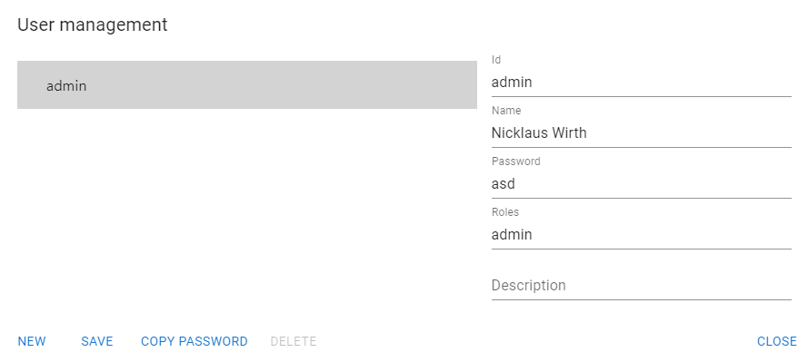

# User management
Explain what is and how to perform user management.

User management is easy and self-explaining.

There exist always an user named 'admin', the one you used when first entering Kwirth. This 'User management' tool allows you to create new users and assign them some permissions. There exist no integration with any IAM system... yet.

