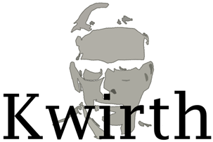

<!-- _coverpage.md -->

#
- Consolidates observability information from different pods, deloyments, namespaces or even **full clusters**.
- Create differente information channels according to your needs

[GitHub](https://github.com/jfvilas/kwirth/)
[Get Started](/index)

