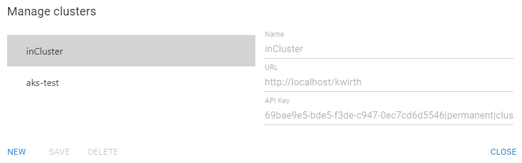
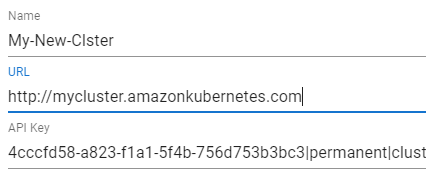
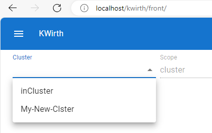

# Cluster management
Cluster management is the tool to add several clusters to your instance of Kwirth. It's important to note that clusters ar not added to Kwirth, **clusters you add do form part of your profile**.

When you access the cluster management tool you see a list of clusters similar to this one:

## Cluser list
On the left side you will always see the list of cluster you have added plus the cluster you are connected to, which will always appear as **'inCluster'**. To manage this list you can add (NEW), remove (DELETE) or modify (SAVE) cluster data, but you cannot perform any of these tasks in respect to your source cluster, which is the cluster you pointed to in your browser, the one named 'inCluster'.

## Cluster data
To add a cluster to your profile you only need to enter three simple data:

- **Name**. the name of the cluster, that must be unique. This is a name for your convenience, does not have to be the real name of the cluster.
- **URL**. The URL where you can access Kwirth in the cluster you are adding.
- **API Key**. An API Key that you must create in the Kwirth instance that is running on the cluster you want to add.

That is, something like this:

&nbsp;&nbsp;&nbsp;&nbsp;

And that's all.

Now, in the cluster selector in the main resource selector you should see the new cluster, something like this:

&nbsp;&nbsp;&nbsp;&nbsp;