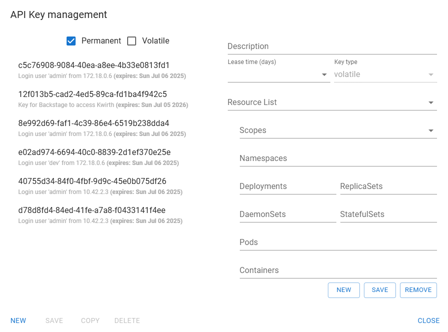
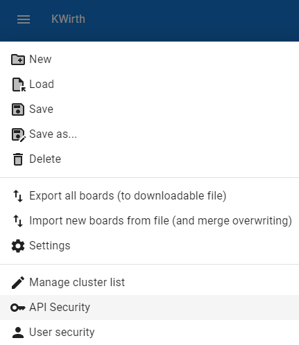
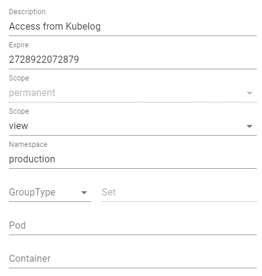

# API management
Access to Kwirth can be performed by using APIs that are secured. When you access Kwirth via its own frontend application, this **React** application obtains an API key for you to work with Kwirth on your very first login.

But there are situations in which you may want to create and share an API key for another external use, like integrating [Backstage Kubelog](https://github.com/jfvilas/kubelog) or [Backstage plugin KwirthMetrics](https://github.com/jfvilas/plugin-kwirth-metrics), for example. In this case, you need to use the API Management tool that is part of Kwirth.



The API management tool (named **API Security**) is accessible from the main menu (the burger icon) but it is only visible to admins and users holding a *scope* of type 'API'.



## API Keys explained
An API key requires the following information to be created:

+++ review according to new resource management formats

- **Description**. For obious reasons it is important to write down what an API key has been created for.
- **Expire**. +++
- **Type**. There exist 3 types ok keys, but only 1 of them can be created in the UI: 'permanent'. PErmanent API keys are stored in a secure site and keep alive even if Kwirth crashes. Other types like 'volatile' or 'bearer' are explained bellow, right now you only need to know that 'volatile' and 'bearer' key types are expected to be used by applications, not by people.
- **Scope**. As explained in other parts of this documentation, the scope is used to decide what actions an API Key owner can perform with the resources declared in the key. These are some valid scopes and their meaning (not a complete list):
    - *cluster*: this scope means you can perform any Kwirth action on the cluster.
    - *api*: this scopes allows you to manage api keys
    - *restart*: this scope allows the owner of the key restartin pods or deployments in the cluster where de key has been created
    - *filter*: this scope allows searching for information on Kubernets objetcs
    - *view*: this scope allows viewing logs (is the more basic scope)
- **Namespace**. It's  **a comma separated list** of namespaces (or just a single one, or nothing).
- **Group Type**. It's the type of set (replica, stateful or daemon) that you want to give access.
- **Group Name**. It's a comma separated list of sets the API can have access to, these can be replica sets, stateful sets or daemon sets.
- **Pod**. A comma separated list of pods.
- **Container**. A comma separated list of container inside a pod that an API key owner can access.

The idea is simple, an API key allows the holder of the key to perform an action (scope) over a set of resources (namespace/group/pod/container).

On the 'API Key Management' dialog you can create, review, modify or delete all the existing API keys in your Kwirth except the 'bearer' type ones. For this purpose, the dialog shows an exhaustive list on the left side of the card, and the details of each selected API key on the right.

## Example
If you want to give permissions to an external application like Kubelog or KwirthLog to view all logs in your 'production' namespace you should create an API key like this:



Which would take this aspect:

```code
93df417c-e124-7d66-12a1-277d3f246bf7|permanent|view:production:::
```
+++ review multi-key

This is the API key you should configure in your client (Kubelog, KwirthLog or whatever) application.

## API Keys, Access Keys and Resource Id
The union of key type (permanent, volatile or bearer), the scope (view, snapshot, restart...), zero or more namespaces, zero or more groups (including its type and name), zero or more pods and zero or more container names *is what we call an **ACCESS KEY***.

When we talk about Access Keys we need to explain its content deeply. This is what an Access Key contains:
  - A unique Id (a UUID) indentifying the access key uniquely.
  - A type of key (permanent, volatile or bearer)
  - A scope and a set of one or more resoure identifiers:
    - **Scope** points to the kind of actions the access key owner can perform: view logs, restart pods, manage apis, receive metrics...
    - **Resource id** is a spec of the resources that the access key owner can be work with (according to previous explained scope) by using this access key.

## Multi cluster support
When you use an instance of Kwirth as an entry door to a multi-cluster system, you need to add clusters, as shown in (cluster managment)[clustermanagement]. For a cluster to be added to another Kwirth instance, you must previously create an API like we've just explained.

## Access key types
For a client to use Kwirth (the API, the channels, the instances...) he must previously obtain an access key, as we have explained. The client must present an Access Key on every subsequent Kwirth API invocation, for example, when starting an instance, connecting to a data stream, etc.

Access keys can be any of these 3 types:

  - **Permanent**. These keys are stored in the kubernetes control plane, so they are usable until its expiration date arrives, even if the Kwirth or the whole cluster is stopped and restarted.
  - **Volatile**. Volatile keys behave exactly like permanent ones in relation to permissions and capabilities, but they are not persisted, that is, they live only inside the memory of the Kwirth instance that created it, so they are not useful if you have more than one replica of a Kwirth core or you are worried about Kwirth, node or cluster restarts.
  - **Bearer**. Bearer keys are not persisted inside Kwirth nor your kubernetes cluster, they are created and digitally signed and sent to the client on his first login. Everytime a client invokes an API he must present the token, and Kwirth core will check its integrity prior to accept client requests. I mean, this is a typical bearer token like the ones used in OAuth, for example. Bearer keys must be presented in an HTTP 'Authorization' header with a format like this one:
    - Authorization: Bearer f417c2a1277d3f24|permanent|view:production:::
    - The id at front of the key (the access key id) is in fact a hash id (cyphered data) used to protect access key from being hacked/tampered for client credentials scalation. Clients can read keys, and must sent them back to servers, but clients cannot modify them.

Anyway, the format and content of a key is exactly the same in all three types of tokens.
