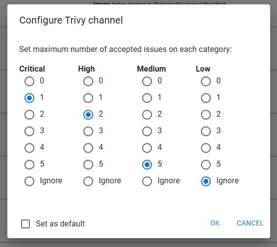
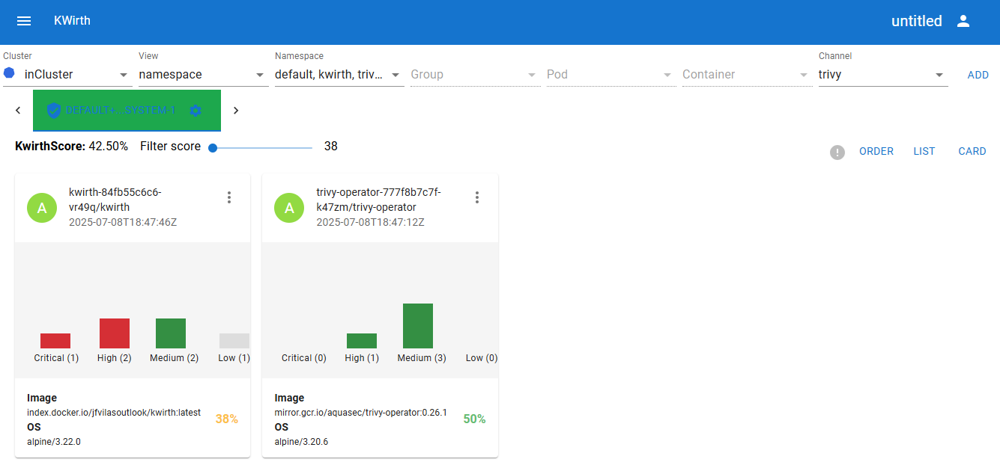
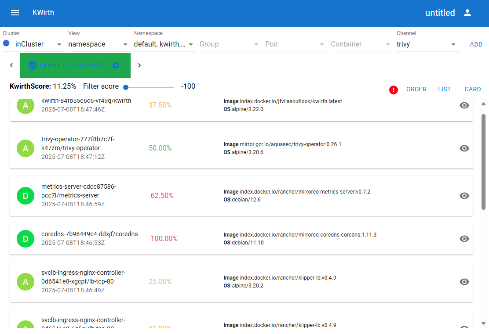
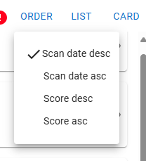
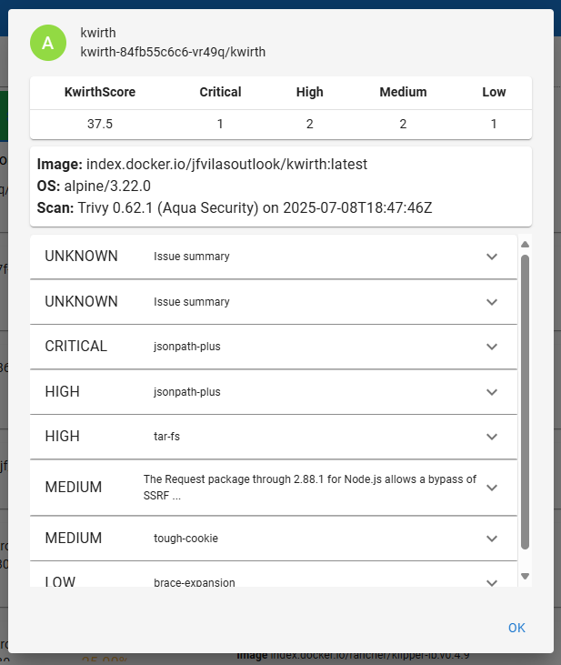
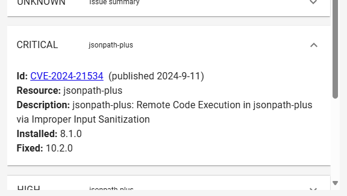
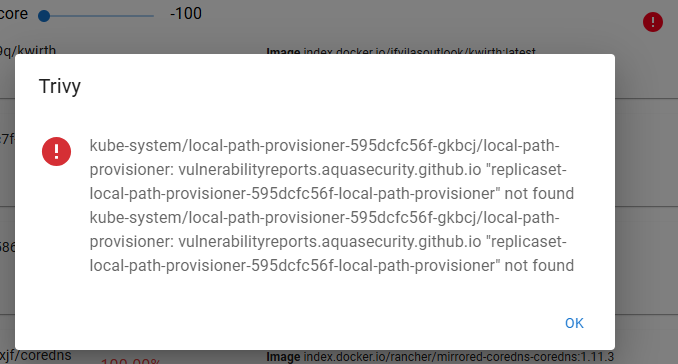
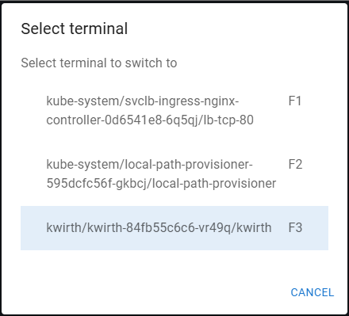
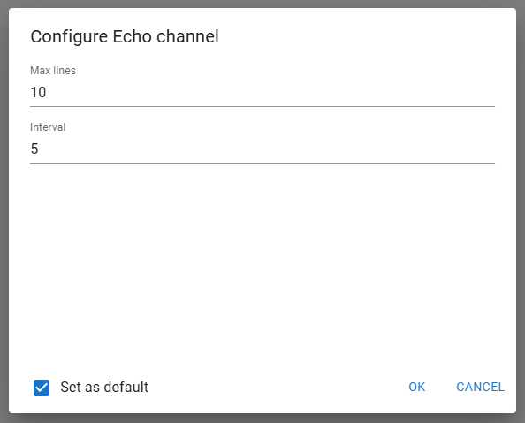

# Channels
As of Kwirth version 0.4, these are the existing channels:

  - **[Log](./channels?id=log)**. Real time log streaming from different source objects (a container, a pod, a namespace or a custom mix of any of them).
  - **[Metrics](./channels?id=metrics)**. Real-time metrics (CPU, memory, I/O, bandwidth...) on a set of objects.
  - **[Alert](./channels?id=alert)**. Alerts based on los messages. Log messages are processed at Kwirth core, so you only receive alerts accordingn to your channel config.
  - **[Echo](./channels?id=echo)**. This is a reference channel for channel implementers, it is not useful for real kubernetes operations.
  - **[Trivy](./channels?id=trivy)**. Get security-related information based on Trivy vulnerability analyzer.
  - **[Ops](./channels?id=ops)**. Perform day-to-day operations like shell, restarts, getting info, etc...

Please follow the links to get specific information on each channel.

## Log
Log channel is the first channel we built inside Kwirth, it was its main purpose in fact. But now, Log Channel is just another channel you can use for receiving container logs in real time.

### What for
You can create log streams that show real time logs of a set of kubernetes objects. When you select the view you can decide what groups of objects you want to use:

  - *Namespace*, view all the logs of a namespace in on stream. As it happens with all the views iniside Kwirth, you can selet more than one object, that is, you can have one stream consolidating all the logs of all the pods of a set of namespaces.
  - *Group*, I mean, a Deployment, a Replicaset, a Statefulset or a Daemonset, or any combination of them.
  - *Pod*, you kknow, a pod or a set of pods that belong to the same or different namespaces.
  - *Container*, a set of containers that belong to the same or different pods, same or different groups and same or different namespaces.

### Features
Log Channel includes two main features:

  - Log streaming, for viewing logs starting form the point you want and in real time.
  - Start diagnostics, for viewing all the log messages that took place when a set of kubernetes objects just started.

### Use
When you start a Log Channel you see the setup card where you can decide what kind of log streaming you want to launch: log streaming or start diagnostics.

The tab taht is selected when you click OK is the feature of Log Channel that will be used.

#### Start diagnostics
Start diagnostics, as mentioned, is real time streaming that **starts when the set of selected kubernetes objects first started**. The parameters you can configure are:

  - **Max Messages**, maximum number of messages to show on the browser. When maximum is reached **the stream will be stopped**.
  - **Max per pod messages**, maximum number of messages per object to add to the screen. When an object reaches the maximum, Kwirth will show no more messages comming from that object, but other objects can add messages while "Max Messages" is not reached.
  - **Message sort order**, depending on the investigation you are performing, you may be interested in viewing object messages in differnet orderings. These are possible orderings:
    - *Show messages as they arrive*, nothing to add here.
    - *Keep together messages from the same pod*, no matter when a messages has ocurred it will be displayed next to other messages form the same pod.
    - *Use message time for sorting*, messages will use message time, no matter the object that originated it.

You can set your selected configuration as a default for future Log Channel startings.

#### Log streaming
Log streaming is useful for viewing object current logs in real time starting from any point in time. Please take into account that a very old starting point can cause your browser to become slow in processing messages, since Kwirth Core sends all the data as quick as it can.

The configuration for log streaming is as follows:

  - **Max Messages**, maximum number of messags to show on the browser. When maximum is reached **oldest messages will start to desappear**.
  - **Get messages from container start time**. You can receive messages form the very start of the object by activating this configuration option. If you don't activate it, you can decide the starting moment by selecting a date/time just below. The default is last 30 minutes.
  - **Get messages of previous container**. When they are available, you can review messages that have been produced by previous run of the same object.
  - **Add timestamp to messages**, activate it to prefix all messages with its occurrence datetime.
  - **Follow new messages**, when you activate this option, the browser will move to the very end when a new message arrives.

You can set your selected configuration as a default for future Log Channel startings.

#### Running
When you start a log stream or a start diagnostic, messages will be prefixed according to the objects you selected. For example, if you did only selected a container, messages will have no prefix. But, if you selected 2 or more containers from the same or diffferent pod, messages will be prefixed with object information (pod name, group name, namespace name...) in order to have accurate information on the origin of the message.

A log stream would look like this:

A start diagnostic, as you can see in the example, may not show messages ordered in message occurrence, it depends on your setup configuration.

## Metrics
Metrics Channel is a very long waited feature that eases your *needs for observability*. Aside from real-time streaming logs (the main original purpose of Kwirth), Metrics Channel can enhance your observability posture by streaming real-time metrics of your Kubernetes objects. As usual, you can build sets of objects by mixing different sources (pods from different namespaces, different whole namespaces...) or even stream real-time metrics for a single container. 

### What for
Metrics Channel can send to your browser (or your Kwirth-API consuming application) real-time observability that Kwirth gathers **directly from cAdvisor**.

!> This is important, **Kwirth does not need Prometheus** or other metrics-scraping software, Kwirth can gather required metrics directly from the kubelets running inside your nodes.

### Features
Main features of Metrics Channel are:

  - Gather metrics directly from cAdvisor/Kubelet (**no Prometheus required**)
  - Show metrics in real-time charts of different kinds: Line, Area, Bar chart or direct value
  - Group your objects to see them together in two different modes:
    - **Agregate**: just sum up the values of same metrics from differnt objects and show it.
    - **Merge**: do not sum up the values, just show the metrics from different objects in the same chart. If you want to merge objects you can also decide whether to **stack** or **overlay** them.
  - As any other channel inside Kwirth, Metrics can reconnect even after losing the websocket connection, so you can stream real-time metrics in a non-stop way.

### Use
When you start the channel you must first setup how you want to receive the metrics and show them on the browser. These are the configuration items you must provide:

+++running
+++WIP

## Alert
Alert channel is a subtype of Log Channel that can be used to rise alerts on information received on logs (in real-time, of course).

### What for
You can configure an alert channel for detecting log messages from objects in scope that match some specific regex. Alert channel is designed to work with three standard severity levels (INFO, WARNING, ERROR) and inform the user when a message has been produced that matches any of the severity levels configured.

You can add, for example, a tab containing all the namespaces in your cluster, this way you can detect veeeeery easily when an ERROR occurs anywhere. Please remember the way Kwirth tabs change its colour when new data is received, so a working alert tab will move from green to yellow when a new alert is received (as well as it occurs with other channels, for sure).

### Features
Alert detection is **performed on the backend**, that is, your browser will only receive alerts accoding to your setup. When you start an Alert Channel this is the information you must prodvide:

  - **Max alerts**, maximum number of alerts to keep on screen, when the maximum is reached, oldest ones will start to disapear.
  - **INFO**, is a list of regex or texts that will be searched for matching INFO alerts.
  - **WARNING**, is a list of regex or texts that will be searched for matching WARNING alerts.
  - **ERROR**, is a list of regex or texts that will be searched for matching ERROR alerts.

When an alert is fired the log message will be shown on the browser according to a typical color code (black, yellow, red)

To add expressions to ERROR alert list (it is the same for INFO and WARNING), you just type in the expression and click con Add. You can enter expressions like these:

  - 'error' (without apostrophes), lines containing the word 'error' will be shon in red.
  - '^ERR', for lines that start with 3 letters ERR.
  - 'OK$', lines ending in 'OK'.
  - '5[0-9][0-9]' lines containing a number between 500 and 599 (typical status code for server error).
  - '.' (a dot), matches any character, so every log line will be a match.

### Use
This is a sample screenshot for an Alert Channel running.

## Trivy
We are very proud of one of the last channel we have added to Kwirth: the Trivy Channel. This channel is based on [Trivy OSS](https://trivy.io). Trivy is an excellent piece of software for observing your cybersecurity threads and be aware of your cybersecurity posture.

Kwrith relies on Trivy to send real-time information about the vulnerabiities of your Kubernetes objects. 

### What for
With Trivy Channel you can:

  - Have an score of the security compliance of your Kubernetes objects. As it always happens with Kwirth, you can calculate the Kwirth Security Score on a customized set of objects. Typically, you would use Trivy Channel to calculate a security exposure about all the ocmponents that comprise an application, no matter the namespace they are running on, no matter if they are pods, replica sets, or just individual containers.
  - For each analyzed object, and based on the information provided by Trivy, you can review what vulnerabilities are present in your images (knowing the specific CVE identifier), which versions are impacted by a CVE, which version contains the ammendment, etc. (this information is, of course, provided by Trivy).
  - You can define a dynamic way of calculating Kwirth Security Score by configuring the number of accepted vulnerabilities of each kind (critical, high, medium, low). Ideally, you would set up a fixed configuraiton for all of your items.

### Features
These are key features of Trivy channel:

  - Calculate Kwirth Secure Score, an overall value that asses you cybersecurity posture.
  - Review vulnerability reports for each object in scope individually.
  - Review each CVE for each impacted object individually.
  - Re-evaluate a vulnerability report for an specific object.

### Use
When you start a Trivy Channel you must provide a few things for the vulnerabiity engine to run and show you some results:

  - **Maximum number of accepted issues** of each category of vulnerability, or even just ignore a specific severity (that means accepting as "good" any number of vulnerabilities of a specific kind).

Here are some screenshots of some operations performed with a Trivy Channel. First one shows a general view of a Trivy Channel:

You can switch the view (a card view with details on each object) to a list view, a more simplistic approach to use when you just need an overview of the global situation.

No matter the kind of view you have selected (card or list), you can decide how to order the objects. Two main options are available: score order, scan date order.

I you want to review the details of a vulnerability report, you can do it (from card or list item) and you will get a list of vulnerabilities including its category (critical, high...) and some details.

IF you want to get detailed info on a specific CVE, just click on it to see the details.

If there exist some problem with a Trivy vulnerability report, you'll be noticed via a red error icon on the screen, and clicking on it you can see some specifics on the error.

## Ops
Ops Channel is a complex functionally rich channel that Kwirth users can use to operate (perform day-to-day operations) on your Kubernetes workload.

A typipcal use case is the one of a developer launching a shell to connect to a container in order to debug some error.

### What for
Ops Channel can be used mainly for:

  - Performing cluster operations like restarts.
  - Launch shell sessions to work with a running container.
  - Show information on running objects.

### Features
The only setup required for starting an Ops Channel is:

  - Decide whether to **keep-alive your shell sessions** in the backend or not. That is, Kwirth will perform some keep-alive activities for the sessions to remain working even if you type nothing all day. In addition, the **reconnect feature of Kwirth** allows you to reconnect to a shell session even if you lost you connection to Kwirth.
  - The other parameter you can configure is the color scheme: light (for normal people), dark (for sysadmins), or 3270 (for mainframe lovers). 

### Use
When you finally launch an Ops Channel the first thing you will see in your screen is the help for the channel and (on the very bottom) an input field where you can type commands in.

It is important to understand the naming structure of objects:

  - You can refer a namespace by its own name (e.g., default)
  - You can refer a pod by qualifying it using its namespace: default/kwirth, kube-system/core-dns, and so on.
  - You can refer a container by indicating the namespace and the pod: default/kwirth-34jfu5/kwirth

This way of referring objects is common to all commands inside Ops Channel. Available commands, as shown in the channel help, are:

  - CLEAR, to clean the screen of your Ops Channel.
  - HELP to get some help on how to use the channel.
  - GET, to obtain some minimal info on an object (GET default, GET default/kwirth).
  - DESCRIBE, to obtain detailed info on an object.
  - LIST, you can see the list of object your Ops Channel session is authorized to work with.
  - EXECUTE, you can send one command to the destination container (a shell command, lik e'ps -A' or 'ls -lisa').
  - RESTART, this command enables you to **restart one container** inside a pod.
  - RESTARTPOD, restarts a pod.
  - RESTARTNS, restarts **a whole namespace**.
  - DELETE, delete a pod, that is, if there is a controller in place, this is the same action as restarting a pod, but, if there is no controller controlling this pod, the pod will disapear.
  - SHELL, well, you can start shell sessions to containers. This Kwirth version includes just TTY sessions, but we have strong plans to include ssh sessions via web... just keep an eye on us.

What follows are some screen shots of the commands.
+++WIP

#### Shell operations
When you start a shell you'll see the shell showing up inside the Ops Channel tab. Aside from working with shell (/bin/sh in fact), you have some interesting keys you can use:

  - F12, go back to Ops Channel (and keep the sessions started) from any shell session.
  - F11, shows a list of started sessions where you can switch to any other one.
  - F1-F10, each shell session is assigned to a function key from 1 to 10, so you can always switch **directly** from one shell session to another one just pressing corresponding function key.
  - Control-D or exit to end a session.

Shell selection will be shown like this:

When you select a shell session you'll see a TTY shell like this one:

## Echo
This channel sends users realtime "echo" information on objects in scope. It has been built for channel implementers to have a simple channel implementtion to use as a starting point.

### What for
It's a reference implementation of a Kwirth channel, and  although that this is its main objective, Echo Channel can also be used to test Kwirth connectivity and to monitor the status of objects in scope.

### Features
You can just configure two options prior to starting an Echo Channel:

  - **Max lines**, maximum number of lines to keep on screen, when the maximum is reached, old lines will start to disapear.
  - **Interval**, seconds to wait before sending next echo from the backend to the frontend.

This is how the Echo setup feels:

You can set your selected configuration as a default for future Echo Channel startings.

### Use
When you add an Echo Channel to your Kwirth desktop, when you start it (after configuring echo interval), Kwirth will start sending information on added objects in a regular basis (your interval in seconds), as shown in next figure.

