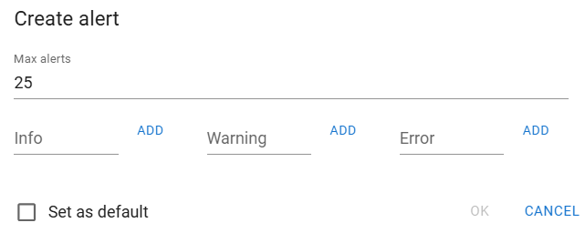

# Alert channel
Alert channel is a subtype of Log Channel that can be used to rise alerts on information received on logs (in real-time, of course).

## What for
You can configure an alert channel for detecting log messages from objects in scope that match some specific regex. Alert channel is designed to work with three standard severity levels (INFO, WARNING, ERROR) and inform the user when a message has been produced that matches any of the severity levels configured.

You can add, for example, a tab containing all the namespaces in your cluster, this way you can detect veeeeery easily when an ERROR occurs anywhere. Please remember the way Kwirth tabs change its colour when new data is received, so a working alert tab will move from green to yellow when a new alert is received (as well as it occurs with other channels, for sure).

## Features
Alert detection is **performed on the backend**, that is, your browser will only receive alerts accoding to your setup. When you start an Alert Channel this is the information you must prodvide:

  - **Max alerts**, maximum number of alerts to keep on screen, when the maximum is reached, oldest ones will start to disapear.
  - **INFO**, is a list of regex or texts that will be searched for matching INFO alerts.
  - **WARNING**, is a list of regex or texts that will be searched for matching WARNING alerts.
  - **ERROR**, is a list of regex or texts that will be searched for matching ERROR alerts.

When an alert is fired the log message will be shown on the browser according to a typical color code (black, yellow, red)

To add expressions to ERROR alert list (it is the same for INFO and WARNING), you just type in the expression and click con Add. You can enter expressions like these:

  - 'error' (without apostrophes), lines containing the word 'error' will be shon in red.
  - '^ERR', for lines that start with 3 letters ERR.
  - 'OK$', lines ending in 'OK'.
  - '5[0-9][0-9]' lines containing a number between 500 and 599 (typical status code for server error).
  - '.' (a dot), matches any character, so every log line will be a match.

## Use
This is a sample screenshot for an Alert Channel running.

