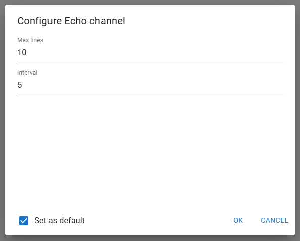
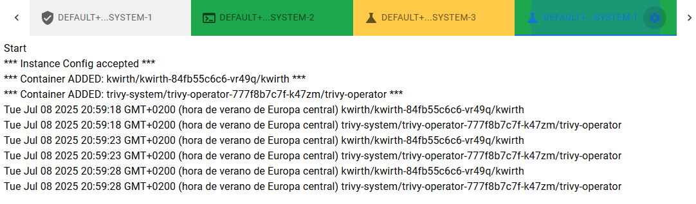

# Echo channel
This channel sends users realtime "echo" information on objects in scope. It has been built for channel implementers to have a simple channel implementtion to use as a starting point.

## What for
It's a reference implementation of a Kwirth channel, and  although that this is its main objective, Echo Channel can also be used to test Kwirth connectivity and to monitor the status of objects in scope.

## Features
You can just configure two options prior to starting an Echo Channel:

  - **Max lines**, maximum number of lines to keep on screen, when the maximum is reached, old lines will start to disapear.
  - **Interval**, seconds to wait before sending next echo from the backend to the frontend.

This is how the Echo setup feels:

You can set your selected configuration as a default for future Echo Channel startings.

## Use
When you add an Echo Channel to your Kwirth desktop, when you start it (after configuring echo interval), Kwirth will start sending information on added objects in a regular basis (your interval in seconds), as shown in next figure.

