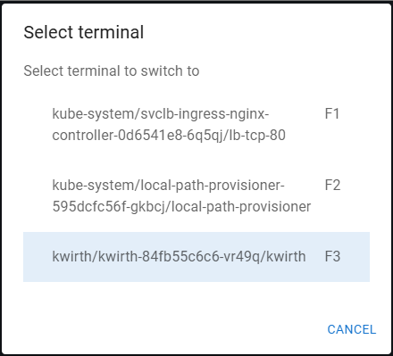
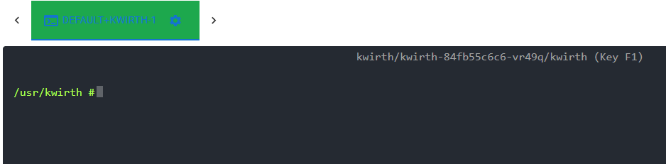

# Ops channel
Ops Channel is a complex functionally rich channel that Kwirth users can use to operate (perform day-to-day operations) on your Kubernetes workload.

A typipcal use case is the one of a developer launching a shell to connect to a container in order to debug some error.

## What for
Ops Channel can be used mainly for:

  - Performing cluster operations like restarts.
  - Launch shell sessions to work with a running container.
  - Show information on running objects.

## Features
The only setup required for starting an Ops Channel is:

  - Decide whether to **keep-alive your shell sessions** in the backend or not. That is, Kwirth will perform some keep-alive activities for the sessions to remain working even if you type nothing all day. In addition, the **reconnect feature of Kwirth** allows you to reconnect to a shell session even if you lost you connection to Kwirth.
  - The other parameter you can configure is the color scheme: light (for normal people), dark (for sysadmins), or 3270 (for mainframe lovers). 

## Use
When you finally launch an Ops Channel the first thing you will see in your screen is the help for the channel and (on the very bottom) an input field where you can type commands in.

It is important to understand the naming structure of objects:

  - You can refer a namespace by its own name (e.g., default)
  - You can refer a pod by qualifying it using its namespace: default/kwirth, kube-system/core-dns, and so on.
  - You can refer a container by indicating the namespace and the pod: default/kwirth-34jfu5/kwirth

This way of referring objects is common to all commands inside Ops Channel. Available commands, as shown in the channel help, are:

  - CLEAR, to clean the screen of your Ops Channel.
  - HELP to get some help on how to use the channel.
  - GET, to obtain some minimal info on an object (GET default, GET default/kwirth).
  - DESCRIBE, to obtain detailed info on an object.
  - LIST, you can see the list of object your Ops Channel session is authorized to work with.
  - EXECUTE, you can send one command to the destination container (a shell command, lik e'ps -A' or 'ls -lisa').
  - RESTART, this command enables you to **restart one container** inside a pod.
  - RESTARTPOD, restarts a pod.
  - RESTARTNS, restarts **a whole namespace**.
  - DELETE, delete a pod, that is, if there is a controller in place, this is the same action as restarting a pod, but, if there is no controller controlling this pod, the pod will disapear.
  - SHELL, well, you can start shell sessions to containers. This Kwirth version includes just TTY sessions, but we have strong plans to include ssh sessions via web... just keep an eye on us.

What follows are some screen shots of the commands.
+++WIP

### Shell operations
When you start a shell you'll see the shell showing up inside the Ops Channel tab. Aside from working with shell (/bin/sh in fact), you have some interesting keys you can use:

  - F12, go back to Ops Channel (and keep the sessions started) from any shell session.
  - F11, shows a list of started sessions where you can switch to any other one.
  - F1-F10, each shell session is assigned to a function key from 1 to 10, so you can always switch **directly** from one shell session to another one just pressing corresponding function key.
  - Control-D or exit to end a session.

Shell selection will be shown like this:

When you select a shell session you'll see a TTY shell like this one:

