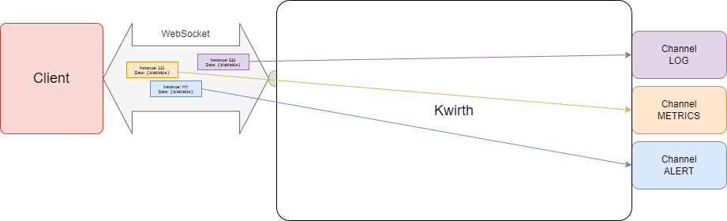

# Channels
On the very first versions of Kwirth all its capabilities were implemented inside Kwirth core. That is, log streaming or the ability to restart pods or deployments were in fact TypeScript modules co-developed and integrated into Kwirth core, the were built next to it, creating one only piece which contains the core backend functionalities (connection to kubernetes cluster, managing security, serving as a storage system for profiles, etc.), the Kwirh capabilities (log streaming, cluster basic operations) and serving the front application (the React module).

Starting with Kwirth 0.3.160 the core has been split into 2 separete blocks:

  1. The core in itself, that is, the Kwirth component that handles WebSockets, security, connections to cluster or HTTP serving.
  2. The interface for implementing features in Kwirth, that is what we call **back channels**, where each channel is a feature (logs, metrics, alerts...)

Starting with Kiwrth 0.4, the React front application has also been rearchitected to refect the way Kwirth core is build:

  1. Having a core front application with minimun functionalities, like security, store, etc...
  2. Add capabilities via **front channels**, that correspond in fact to the above mentioned back channels .

According to this structure, the different features that users expect to use with Kwirth are what we call **channels**. For example, receive real-time log streams is just one feature, so there exists a **channel** that implements this feature in the backend and also in the frontend.

Or, for example, since Kwirth 0.3.160 you can receive cluster metrics via a real-time metrics-stream. You can receive information about CPU usage for containers, pods, groups or namespaces. Metrics is another different **channel**. In fact, you can start your Kwirth instance deciding what channels to enable or disable and what other external channels you want to add to your Kwirth instance.

We have plans to integrate channels into **'plugins'**, exactly the way [Backstage plugins](https://backstage.io/plugins) work.


## What are channels?
A **channel** is the implementation of a specific feature. For example you can create a channel for receiving info on ConfigMap in such a way that any change to ConfigMaps can be streamed in real-time for somebody to be informed of such changes. Or you can build a channel for exporting log streams in real-time (the original idea behind Kwirth).

That is, a channel is in fact an implementation of a feature that must be built according to a specification (that we will explain afterwards) and does not need to be linked nor built with Kwirth core, a channel can be even loaded at runtime.


### Instances
For being flexible enough to accomodate a big volume of workload without consuming too much resources of the backend or an excessive ammount of resources of your clients (typically browsers), web sockets (where real-time data streaming takes place) do support exchanging information with clients using a subchannel-like mechanism, that's what we call an **instance**.

?> You can have different instances (with different config) exchanging info over the same websocket.


### Summarizing
The main concepts to keep in mind when thinking in a Kwirth way are: features (i.e., channels), web sockets (communication with clients) and instances (services the clients use). All this stuff is shown on next figure.



### Kwirth Core
With the introduction of channels, all the specific logic for handling and serving Kubernetes data has been moved to channel implementations, so, what remains inside Kwirth is what we call **Kwirth core**, and that comprises:

  - Access Key validation, receiving access keys and ensuring they are valid.
  - Scoping, that is, ensuring that AccessKey presented by clients can perform the actions that they are requesting.
  - Messaging validation and distribution (to channels). Core is in charge of receiving requests, validating them, and sending them away to the proper channel.
  - Access to Kubernetes API. Kubernetes API is a key part of the process, and Kwirth Core is the only responsible of accessing Kubernetes for executing different actions, like retrieving metrics from cAdvisor, creating log streams, etc.

What follows is a zoomed view of Kwirth core.


## Existing channels
Starting with Kwirth 0.3.160 these are the channels you will find integrated inside Kwirth core:

  - **Log**. You can open log streams for receiving container/pod/group/namespace aggregated log streams in real time.
  - **Metrics**. You can receive metrics information related to container/pod/group/namespace aggregated objects.
  - **Alert**. Client can configure alerts for filtering aggregated log streams at origin.
  - **Echo**. This is a reference channel for channel implementers, it is not useful for real kubernetes operations.
  - **Trivy**. This is a very interesting channel for kwnow your vulnerabilities exposure based on Trivy. Trivy is fully integrated into Kwirth through this channel.
  - **Ops**. This is a channel you cna use for performing common operations on your cluster, like launching a shell to a pod or restarting a pod. But Ops channels includes some intersting features like restarting a namespace, or keeping shell terminals connected for a lifetime

It is important to note that **Kwirth always includes a basic front React applicaton**, but you can integrate Kwirth with your own clients by using Kwirth API.

For getting specific information on each channel follow [this link](./list).

## Back channels and front channels: two parts of the same thing
Starting in Kwirth 0.3 and ending in Kwirth 0.4, Kwirth features are implementd via channels, undertanding a channel is an extension to Kwirth where capabilities are implemented.

When you create a Kwirth channel you must undertand that the channel is splitted into two different artifacts:

  - **Back channel**, that is, a Kwirth core extendsion that receives requests fron clients and interacts with your source (Kubernetes, Docker or whatever it be).
  - **Front channel**, is an extension artifact to be loaded into front application, it handles user interaction and communicates with backend. Please keep in mid Kwirth core is not strongly coupled to Kwirth front end, you can implement your own Kwirth clients. When we talk about front channels, we are referring to plugins to be added to **Kwirth front React application**.

Front channels communicate wuth back channels through an open websocket that Kwirth front app and Kwirth core use for data streaming.

## Back Channel development
The channel system has been designed to allow **an ordered evolution of Kwirth core** and, at the same time, to serve as a basis for other developers to create its own channels, that is, its own data-streaming services for Kubernetes.

Creating a channel involves the following processes:

  1. Design your channel.
  2. Implement the channel interface.
  3. Configure your Kwirth.

### The channel interface
When you create a new channel, the first thing you should do is to review the interface you must implement for your channel to be integrable with Kwirth. This is how the channel system has been defined for the 0.3.160 version of Kwirth:

```typescript
interface IChannel {
    getChannelData() : BackChannelData
    getChannelScopeLevel(scope:string) : number
    
    startInstance (webSocket:WebSocket, instanceConfig:InstanceConfig, podNamespace:string, podName:string, containerName:string) : void
    pauseContinueInstance (webSocket: WebSocket, instanceConfig: InstanceConfig, action:InstanceMessageActionEnum) : void
    modifyInstance (webSocket: WebSocket, instanceConfig: InstanceConfig) : void
    containsInstance (instanceId:string) : boolean
    stopInstance (webSocket:WebSocket, instanceConfig:InstanceConfig) : void
    removeInstance (webSocket:WebSocket, instanceId:string) : void

    processCommand (webSocket:WebSocket, instanceMessage:InstanceMessage, podNamespace?:string, podName?:string, containerName?:string) : Promise<boolean>

    containsConnection (webSocket:WebSocket) : boolean
    removeConnection (webSocket:WebSocket) : void
    refreshConnection (webSocket:WebSocket) : boolean
    updateConnection (webSocket:WebSocket, instanceId:string) : boolean
}
```

And this is a short explanation on each function:
  - **getChannelData**. The back channel must implement this function to inform Kwirth core which capabilities does it support. This refers to things like 'pausing', 'reconnecting', source support (Kubernetes, MesOS, Docker...), routing, metrics, etc.
  - **getChannelScopeLevel**. Your channel may need to offer different scope levels to your users. For example, in metrics channel the clients can just do SNAPSHOT (obtaining a set of metrics and its values) or do STREAM (that is, obtaining metrics through a stream of data implemented as an instance inside a web socket). This function returns an id that Kwirth core uses for deciding if a specific user has an Access Key with a scope for performing the fucntion he requested. For example, if the user has an access key for getting SNAPSHOT (value 1) and requests a metrics STREAM (value 2), Kwirth will deny the request.
  - **startInstance**. This function is invoked when a client requests to start a new instance of the channel.
  - **pauseContinueInstance**. This funciton will be invoked when the client connected to the channel wants to pause receiving data (but not stopping the instance) or continue receiving data if instance has been previously paused.
  - **modifyInstance**. Modify instance (if enabled for your channel) will be invoked if the connected client wants to make some changes on instance configuration.
  - **containsInstance**. This fucntion provides Kwirth core with the ability to discover which type of channel a web socket belongs to.
  - **stopInstance**. stopInstance is invoked when the client wants to stop an instance.
  - **removeInstance**. Kwirth core may invoke your channel removeInstance function for helping your channel keep healthy information on your clients.
  - **containsConnection**, the channel should return true/false indicating if it contains a specific connection (identified by its websocket).
  - **refreshConnection**, Kwirth core informs channels when a front client sends a "ping", ofr back channels to kwnow if clients are still alive (or to know last time client was alive). The connection is identified by thw websocket.
  - **updateConnection**. If your channel supports reconnect actions, this is the function call your channel will receive when a client connets an exiting instance with a new web socket. The connection is identified by thw websocket.
  - **removeConnection**. When a web socket is closed, due to an error, a client request to close a socket or whatever, Kwirth core will invoke this function for your channel to perform cleaning functions (removeConnection would typically remove all instances of the web socket). The connection is identified by thw websocket.

Please be aware of the difference that exists between an instance and the real communications transport (a web socket). When a client starts an intance, a web socket must be created and connected previously. And remember, **a web socket can carry multiple instances of the same channel**.

### Available data structures
The main data structure you will face when working with channels (aside form some basic data stored in strings or numbers) is **InstanceConfig**, which is the structure that contains all the data related to an instance.

InstanceConfig is declared like this:
```typescript
export interface InstanceConfig {
    objects: InstanceConfigObjectEnum
    accessKey: string
    scope: string
    view: InstanceConfigViewEnum
    namespace: string
    group: string
    pod: string
    container: string
    data?: any
}
```

And is an extension of InstanceMessage, which is declared like this:
```typescript
export interface InstanceMessage {
    action: InstanceMessageActionEnum
    flow: InstanceMessageFlowEnum
    type: InstanceMessageTypeEnum
    channel: string
    instance: string
}
```

So, these are all the properties included in an 'start instance' message (an instance config message):

 - **channel**. It is the id of the channel ('log', 'metrics', 'alert', or your own).
 - **objects**. It points to the type of kubernetes object your channel will manage: 'pods' and 'events' are the only ones starting with Kwirth 0.3.160.
 - **action**. The action the client is requesting or the server is answering, for exmaple: 'start', 'stop', 'pause'...
 - **flow**. Indicates the direction of the message: 'request' flows from client to server and 'response' flows back.
 - **instance**. Is the id of the instance the client or the server are working with by using this specific instance config.
 - **accessKey**. As we have explained, this is a string contianing the access key the client has obtained previously.
 - **scope**. This is the scope the client is requesting.
 - **view**. This indicates at which level the instance will be working. Only values allowed are: 'container', 'pod', 'group', 'namespace'.
 - **namespace**. Is a comma-separated list of namespaces (or blank).
 - **group**.  Is a comma-separated list of groups (a group can be a deployment, replica set, a daemon set and a stateful set) (or blank).
 - **pod**.  Is a comma-separated list of pod names (or blank).
 - **container**.  Is a comma-separated list of container names (or blank).
 - **type**. The type fo message being sent ('signal' or 'data').
 - **data**. This is a generic holder for your channel specific data.

This strucutre (and some others), as well as some 'enums', are included in the (**@jfvilas/kwirth-common**)[https://www.npmjs.com/package/@jfvilas/kwirth-common] package.


## Front Channel development
Starting with Kwirth 0.4 the front React app has been rearchitected to support the channel system in such a way that front features are implement *separately* via front plugins. For easing front channel development, the Kwirth team has created an interface that Front Channels must implement.

```typescript
interface IChannel {
    SetupDialog: React.FC<ISetupProps>
    TabContent: React.FC<IContentProps>
    readonly channelId: string

    requiresMetrics():boolean
    requiresAccessString():boolean
    requiresWebSocket():boolean
    getScope(): string
    getChannelIcon(): JSX.Element
    getSetupVisibility():boolean
    setSetupVisibility(visibility:boolean):void
    processChannelMessage (channelObject:IChannelObject, wsEvent:MessageEvent): IChannelMessageAction
    initChannel(channelObject:IChannelObject): boolean
    startChannel(channelObject:IChannelObject): boolean
    pauseChannel(channelObject:IChannelObject): boolean
    continueChannel(channelObject:IChannelObject): boolean
    stopChannel(channelObject:IChannelObject): boolean
    socketDisconnected(channelObject: IChannelObject): boolean
    socketReconnect(channelObject: IChannelObject): boolean
}
```

And this is the explanation for each memeber of the interface:

  - **SetupDialog: React.FC<ISetupProps>**, it is a function that implements a React Functional Component
  - **TabContent: React.FC<IContentProps>**, it is a function that implements a React Functional Component
  - **readonly channelId: string**, it is the channel Id ('log', 'metrics', 'trivy',...) it must be unique. The same id is used also in back channels.
  - **requiresMetrics():boolean**, returns a value indicating if the channel requires the use of metrics (Kubernetes metrics, Docker metrics, etc...). If front channel requires metrics, Kwirth front will inject a list of available metrics when using the channel. That list comes from back channel.
  - **requiresAccessString():boolean**, must return a value indicating if the channel requires using the access Key. This is not normally needed, but it is a requirement if the channel plans to communicate directly to corresponding back channel.
  - **requiresWebSocket():boolean**, as explained before, if the front channel requires sending/receiving data over the channel websocket, this function must return **true**.
  - **getScope(): string**, channel must return the minimum scope needed to use the channel 
  - **getChannelIcon(): JSX.Element**, returns an SVG icon that will be shown on tabs nect to the name of the tab in front app.
  - **getSetupVisibility():boolean**, channel must return the visibulity status of the SetUp dialog.
  - **setSetupVisibility(visibility:boolean):void**, Kwirth informs channel about a new visibility status for the SetUp dialog.
  - **processChannelMessage (channelObject:IChannelObject, wsEvent:MessageEvent): IChannelMessageAction**, when a channel message is received from a Back Channel via a connected websocket, the message is delivered to the channel for its further processing.
  - **initChannel(channelObject:IChannelObject): boolean**, Kwirth will invoke this function when a new tab using this channel is first created (exactly after the user selects resources and clicks 'ADD' on resource selector).
  - **startChannel(channelObject:IChannelObject): boolean**, this function will be invoked when the user clicks on 'START' to start the channel.
  - **pauseChannel(channelObject:IChannelObject): boolean**, when the user click on 'PAUSE' Kwirth front will invoke this function.
  - **continueChannel(channelObject:IChannelObject): boolean**, when the user click on 'CONTINUE' on a paused channel, Kwirth front will invoke this function.
  - **stopChannel(channelObject:IChannelObject): boolean**, this function will be invoked when the user clicks on 'STOP' to stop the channel.
  - **socketDisconnected(channelObject: IChannelObject): boolean**, when the websocket is disconnected (user removing a tab, for example) Kwirth will invoke this function.
  - **socketReconnect(channelObject: IChannelObject): boolean**, , when a connection to a back channel is restored creating a new websocket (after websocket connection has been lost due to communication errors),  Kwirth will invoke this function.

All the information nnede to run a channel is atored in an instance of IChannelObject:

```Typescript
interface IChannelObject {
    clusterName: string
    view: InstanceConfigViewEnum
    namespace: string
    group: string
    pod: string
    container: string
    instanceId: string
    instanceConfig: any
    uiConfig: any
    uiData: any
    metricsList?: Map<string, MetricDescription>
    accessString?: string
    webSocket?: WebSocket
}
```

As you may see, metricsList, accessString and webSocket are optional, they depend on the abovementioned **requires...**.

uiData, uiConfig and instanceConfig are alos channel-specific.

### Sample implementation
For a simple implementaiton of a channel, please review [echo Back Channel](https://github.com/jfvilas/kwirth/tree/master/back/src/channels/echo) and [echo Front Channel](https://github.com/jfvilas/kwirth/tree/master/front/src/channels/echo) on GitHub.

This is a reference implementation that you can use as a starter pack for channel development.
