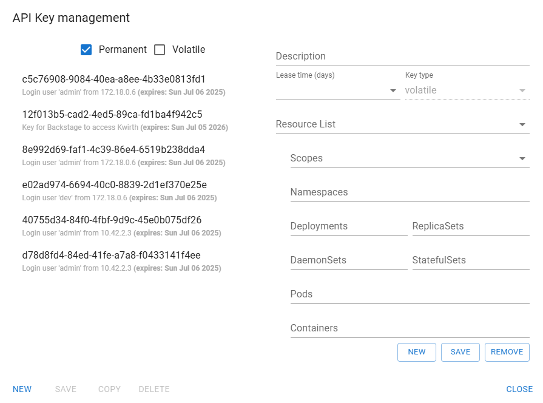
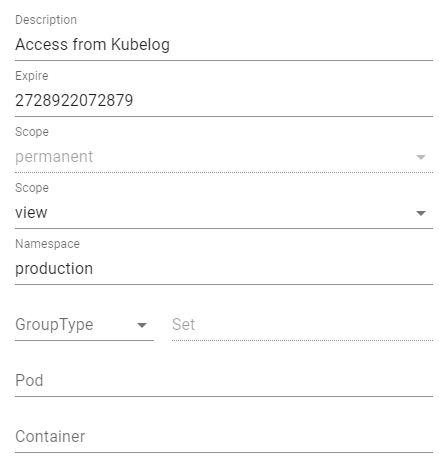

# API management [PENDING RE-WRITING]
Access to Kwirth is performed by using APIs that are secured. When you access Kwirth via its own frontend application, this React application obtains an API key for you to work with Kwirth.

But there are situations in which you want to create and share an API for another external use, like integrating [Backstage Kubelog](https://github.com/jfvilas/kubelog), for example. In this case, you need to use this API Management tool.



The API management tool (names **API Security**) is on the main menu (the burger icon) but is only vicible to admins and users with the API scope.


## API Keys explained

An API key requires following information to be created:

- **Description**. For obious reasons it is important to write down what an API key has been created for.
- **Expire**. In milliseconds, absolute expire moment for the API Key.
- **Type**. There are 2 types: 'permanent', that are stored in a secure site and keep alive even if Kwirth crashes, or 'volatile' they only live in memory, they are not persisted to any storage. When you create Key s manually you can only create 'permanent' keys. 'volatile' keys are expected to be created by other applications.
- **Scope**. As explained in other parts of this documentation, the scope is used to decide what an API Key owner can do with the resuources declared in the key. This are the valid scopes and their meaning:
    - cluster: this scope means you can permform any Kwirth action on the cluster.
    - api: this scopes allows you to manage api keys
    - restart: this scope allows the owner of the key restartin pods or deployments in the cluster where de key has been created
    - view: this scope allows viewing logs (is the more basic scope)
- **Namespace**. It's  **a comma separated list** of namespaces (or just a single one, or nothing).
- **Group Type**. It's the type of set (replica, stateful or daemon) that you want to give access.
- **Group Name**. It's a comma separated list of sets the API can have access to, these can be replica sets, stateful sets or daemon sets.
- **Pod**. A comma separated list of pods.
- **Container**. A comma separated list of container inside a pod that an API key can access.

On the left side of the dialog you can see a list of currently existing API keys, and you can filter the list by selecting Permanent or Volatile on top of the list.

## Example
If you want to concede permissions to an external application like Kubelog to view all logs in your 'production' namespace you shoult create an API key like this:



Which would take this aspect:

```code
93df417c-e124-7d66-12a1-277d3f246bf7|permanent|view:production:::
```

This is the API key you should configure in your client application.


## API Keys, Access Keys and Resource Id
The union of key type (permanent or volatile), scope (view, restart...), namespace, group (type and name), pod and container is what we call an **ACCESS KEY**. That is, the API key is the sum of the Access Key plus its expiration date.

When we talk about Access Keys we need to explain its content deeply. This is what an Access Key contains:
  - An unique Id (a GUID).
  - The type of key (permant, volatile or whatever)
  - The scope and the resoure identifier:
    - Scope is points to the kind of actions that can be done: view logs, restart pods, manage apis...
    - Resource id is a pattern which states what resrouces can be managed (accoriding to scope) by using this Access Key.

That is, an API Key contains an **expiration date and an Access Key**. And an access key contains the **type, the scope and the resource id**. And the resource id is a declaration of a set of names (nad list of names) of objects from the cluster that match with the names declared in the resource id.


## Multi cluster support
When you use an instance of Kwirth as a gate to a multi-cluster log management system, you need to add clusters, as shown in (cluster managment)[clustermanagemnet]. For a cluster to be added to another Kwirth instance, you must previously create an API like we've just explained.
