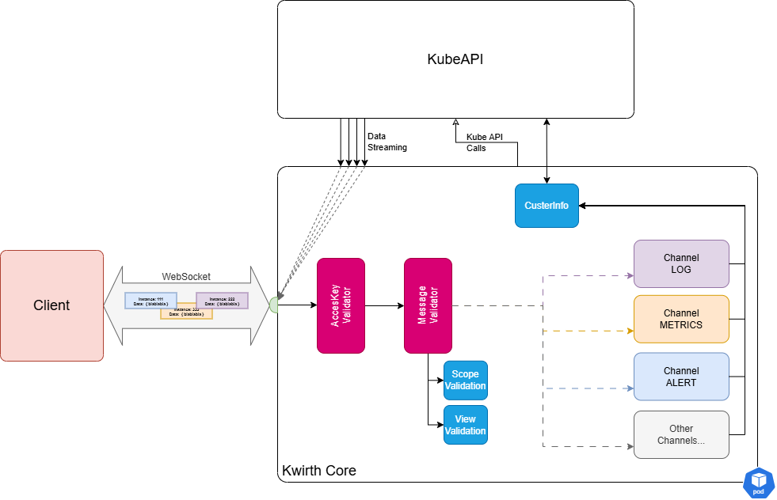

# Channels
On the very first versiones of Kwirth all its capabilities were implemented inside core Kwirth code. Tha it, log streaming or the ability to restart pods or deployments were TYpeSCrit modules co-develoepd wit Kwirth core and built next to it, creating one only piece which contains the core backend fucnotnailities (conneciton to kubernetes cluster, managing security, serving as a storage system for profiles, etc.), the Kwirh capabiities (log streaming, cluster basic operations) and serving the front application (the React module).

Starting with Kwirth 0.4 the core has been split into 2 separete blocks:

  1. The core in it self, that is, the artifact that handles WebSockets, security, connections to cluster or HTTP serving.
  2. The interface for implementing capabilities in Kwirth.

According to this strcuture the different capabilities of Kwirth are what we call channel. For example, receive real-tie log streams is just one capabiitie, so there existe a **channel** that implements this capability. Since Kwirth 0.4 you ca receive cluster metrics via a real-time metrics-stream. For example you can receive information about CPU usage for containers, pods, groups or namespaces. Metrics is another different **channel**. In fact, you can start your Kwirth instance deciding what channels to enable or disabel and what other external channels you want to add to your Kwirth instance.

## What are channels?
A **channel** is the implementation o a aspecifica capability. For example you can create a channel for reciving info on ConfigMap in such a way that any modificaton o ConfigMaps can be streamed in real-time for somebody to be informed of such changes. O you can build a channel for exporting log streams in real-time.

That is, a channel is in fact an implementation of a capability that must be built according to a specification (that we explain afterwards) and does not need to be linked to Kwirth core, a channel can be loaded in runtime.

### Instances
For being flexible enogugh to accomodate a big volume of workload without consuming too much resources of th ebackend or an excessive ammount of resources of your clientes (typically a browser), web sockets (where real-time data streaming takes place) do suport exchangin information with clients using a subchannle-like mechanism, that's what we call an instance.

### Summarizing
The main concepts to keep in mind when thinking in a Kwirth way are: capabilities (i.e., channels), web sockets (communication with clients) and instances (services the clients use). All this stuff is shown on next figure.


### Kwirth Core
With the introduction of channels, all the specific logic for handling and serving Kubernetes data has been moved to channel implementations, so, what remains inside Kwirth is what we call **Kwirth core**, and that comprises:

  - Access Key validation, receive access keys and ensure they are valid.
  - Scoping, that is, ensuring that AccessKey presented by clients can perform the actions that they are requesting.
  - Messaging validation and distribution (to channels). Core is incharge of receiving requests, validating them, annd send them away to the proper channel.
  - Access to Kubernetes API. Kubernetes API is a key part of the process, and Kwirth Core is the only responsible of accessing Kubernetes for executing different acitons, like retrieving metrics from cAdvisor, creating log streams, etc.

What follows is a zoomed view of Kwirth core.



## Existing channels
Starting with Kwirth 0.4 these are the channels you will find integrated inside Kwirth core:

  - Log. You can open log streams for receiving contaner/pod/group/namespace aggregated log streams  in real time.
  - Metrics. You can receive metrics information related to contaner/pod/group/namespace aggregated objects.
  - Alert. Client can configure alerts for filtering aggregated log streams at origin.

It is important to note that **Kwirth always includes a basic front React applicaton**, but you can integrate Kwirth with your own clients. 

## Channel development
The channel system has been designed to allow **an ordered evolution of Kwirth core** and, at the same time, to serve as a basis for other developers to create its own channels, that is, its own data-streaming services for Kubernetes.

Creating a channle involves the following processes:

  1. Desing your channel.
  2. Implement the channel interface.
  3. Configure your Kwirth.

### The channel interface
When you decide to create a new channel, the first thing you should do is to review te interface you must implement for your channel to be integrable inside Kwirth. This is how the channel system has been defined for the 0.2 version of Kwirth:

```typescript
interface IChannel {
    getCapabilities(): ChannelCapabilities
    getChannelScopeLevel(scope:string) : number
    
    startInstance (webSocket:WebSocket, instanceConfig:InstanceConfig, podNamespace:string, podName:string, containerName:string) : void
    pauseContinueInstance (webSocket: WebSocket, instanceConfig: InstanceConfig, action:InstanceConfigActionEnum) : void
    modifyInstance (webSocket: WebSocket, instanceConfig: InstanceConfig) : void
    containsInstance (instanceId:string) : boolean
    stopInstance (webSocket:WebSocket, instanceConfig:InstanceConfig) : void
    removeInstance (webSocket:WebSocket, instanceId:string) : void

    removeConnection (webSocket:WebSocket) : void
    updateConnection (webSocket:WebSocket, instanceId:string) : boolean
}
```

And this is a short explanation on each function:
  - **getChannelScopeLevel**. Your channel may need to offer different scope levels to your users. For example, in metrics channel the clients can just do SNAPSHOT (obtaining a set of metrics) of do STREAM (that is obtainig metrics through a stream of data implemented as an instance on a web socket). This functio return an id that Kwirth core uses for deciding if a specific user has an Access Key with a scope for performing the fucntion he requested. For example, if the user has an access key for getting SNAPSHOT (value 1) and requests a metrics STREAM (value 2), Kwirth will deny the request.
  - **startInstance**. This function is invoked when a client requests to start a new instance of the channel.
  - **pauseContinueInstance**. This funciton will be invoked when the client connected to the channel wants to pause receiving data (but not stopping the instance) or continue receiving data if instance has been previously paused.
  - **modifyInstance**. Modify instance (if enabled for your channel) will be invoked if the connected client wants to make some changes on instance configuration..
  - **containsInstance**. This fucntion provides Kwirth core with the ability to discover which type of channel a web socket belongs to.
  - **stopInstance**. stopInstance is invoked when the client wants to stop an instance.
  - **removeInstance**. Kwirth core may invoke your channel removeInstance function for helping your channel keep healthy information on your clients.
  - **removeConnection**. When a web socket is closed, doue to an oerro, a client request to close it or whatever, Kwirth core will invoke this function for your channel to perform cleaning functions.
  - **updateConnection**. If your channel supports reconnect actions, this is the function call your channel will receive when a client connets an exiting instanc wit a new web socket.

Please be aware of the difference that exists between an instance and the real communications transport (a web socket). When a client starts an intance, a web socket must be created and connected previously. And remember, **a web socket can carry multiple instances of the same channel**.

### Available data structures
The main data structure you will face when working with channels (aside form some basic data stored in strings or numbers) is **InstanceConfig**, which is the structure that contains all the data related to an instance.

InstanceConfig is declared like this:
```typescript
export interface InstanceConfig {
    channel: string
    objects: InstanceConfigObjectEnum
    action: InstanceConfigActionEnum
    flow: InstanceConfigFlowEnum
    instance: string
    accessKey: string
    scope: string
    view: InstanceConfigViewEnum
    namespace: string
    group: string
    pod: string
    container: string
    reconnectKey?: string
    data?: any
}
```

And this is what each property means:

 - **channel**. It is the id of the channel ('log', 'metrics', 'alert', or your own).
 - **objects**. It points to the type of kubernetes object your channel will manage: 'pods' and 'events' are the only ones starting with Kwirth 0.4.
 - **action**. The action the client is requestng or the server is answering, for exmaple: 'start', 'stop', 'pause'...
 - **flow**. Indicates the direction of the message: 'request' flows from client to server and 'response' flows back.
 - **instance**. Is the id of the instance the client or the server are working with by using this specific instance config.
 - **accessKey**. As we have explained, this is a string contiaing the access key the client has obtained previously.
 - **scope**. This is the scope the client is requesting.
 - **view**. This indicates at which level the instance will be working. Values are the ones in this list: 'container', 'pod', 'group', 'namespace'.
 - **namespace**. Is a comma-separated list of namespaces (or blank).
 - **group**.  Is a comma-separated list of groups (a group can be a deployment, replica set, a daemon set and a stateful set) (or blank).
 - **pod**.  Is a comma-separated list of pod names (or blank).
 - **container**.  Is a comma-separated list of container names (or blank).
 - **reconnectKey**. Is a reconnect key (obtained when starting an instance) that you can use to reconnect a broken web socket connection.
 - **data**. This is a generic holder for your channel data.

This strucutre (and some others) as well as the enums, are included in the **@jfvilas/kwirth-common** package.
