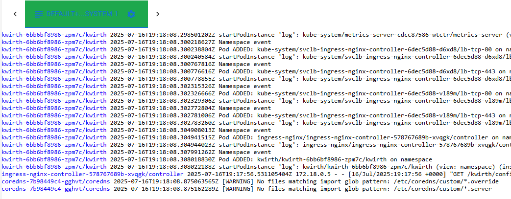
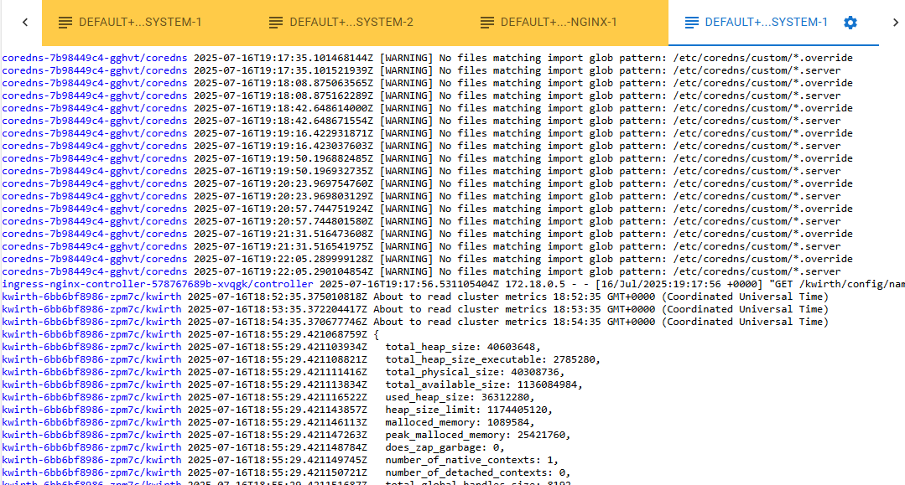

# Log channel
Log channel is the first channel we built inside Kwirth, it was its main purpose in fact. But now, Log Channel is just another channel you can use for receiving container logs in real time.

## What for
You can create log streams that show real time logs of a set of kubernetes objects. When you select the view you can decide what groups of objects you want to use:

  - *Namespace*, view all the logs of a namespace in on stream. AS it occcurs with all the views iniside Kwirth, you can selet more than one object, that is, you can have one stream consolidating all the logs of all the pods of a set of namespaces.
  - *Group*, I mean, a Deployment a Replicaset, a Statefulset or a Daemonset, or any combination of them.
  - *Pod*, you kknow, a pod or a set of pods that belong to the same or different namespaces.
  - *Container*, a set of containers that belong to the same or different pods, same or different groups and same or different namespaces.

## Features
Log Channel includes two main features:

  - Log streaming, for viewing logs starting form the point you want and in real time.
  - Start diagnostics, for viewing all the log messages that took place when a set of kubernetes objects just started,

## Use
When you start a Log Channel you see the setup card where you can decide what kind of log streaming you want to launch: log streaming or start diagnostics.

The tab selected when you click OK is the feature of Log Channel that will be used.

### Start diagnostics
Start diagnostics, as mentioned, is real time streaming that **starts when the set of selected kubernetes objects first started**. The parameters you can configure are:

  - **Max Messages**, maximum number of messags to show on the browser. When maximum is reached **the stream will be stopped**.
  - **Max per pod messages**, maximum number of messages per object to add to the screen. When an object reaches the maximum, Kwirth will show no more messages comming from that object, but other objects can add messages while "Max Messages" is not reached.
  - **Message sort order**, depending on the investigation you ar performing you may be interested in viewing object messages in differnet orderings. Thses are possible orderings:
    - *Show messages as they arrive*, nothing to add here.
    - *Keep together messages from the same pod*, no matter when a messages has ocurred it will be displayed next to other messages form the same pod.
    - *Use message time for sorting*, messages will using message time, no matter the object that originated it.

You can set your selected configuration as a default for future Log Channel startings.

### Log streaming
Log streaming is useful for viewing object current logs in real time, starting from any point in time. Please take into account that a very old starting point can cause your browser to become slow in processing messages, since Kwirth Core sendd all the data as quick as it can.

The configurartion for log streaming is as follows:

  - **Max Messages**, maximum number of messags to show on the browser. When maximum is reached **the stream will be stopped**.
  - **Get messages from container start time**. You can receive messages form the very start of the object by activating this configuration option. If you don't activate it, you can decide the starting moment by selecting a date/time just below. The default is last 30 minutes.
  - **Get messages of previous container**. when they are available, you can review messages that have been produced by previous run of the same object.
  - **Add timestamp to messages**, activate it to prefix all messages with it's occurrence datetime.
  - **Follow new messages**, when you activate this option, the browser will move to the very end when a new message arrives.

You can set your selected configuration as a default for future Log Channel startings.

### Running
When you start a log stream or a start diagnostic, messages will be prefixed according to the objects you selected. For example, if you did only selected a container, messages will have no prefix. But, if you selected 2 or mor containers form the same or diffferent pod, messages will be prefixed with object information (pod nam, group name, namespace name...) in order to have accurate information on the origin of the message.

A log stream would look like this:

A start diagnostics, as you can see in the example, may not show messages ordered in message occurrence, it depends on your setup configuration.
