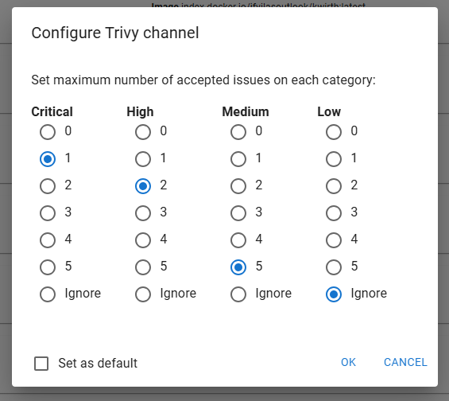
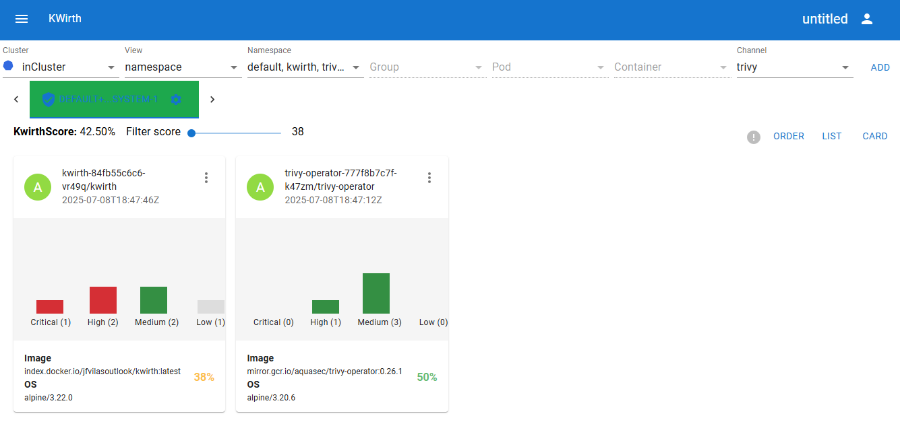
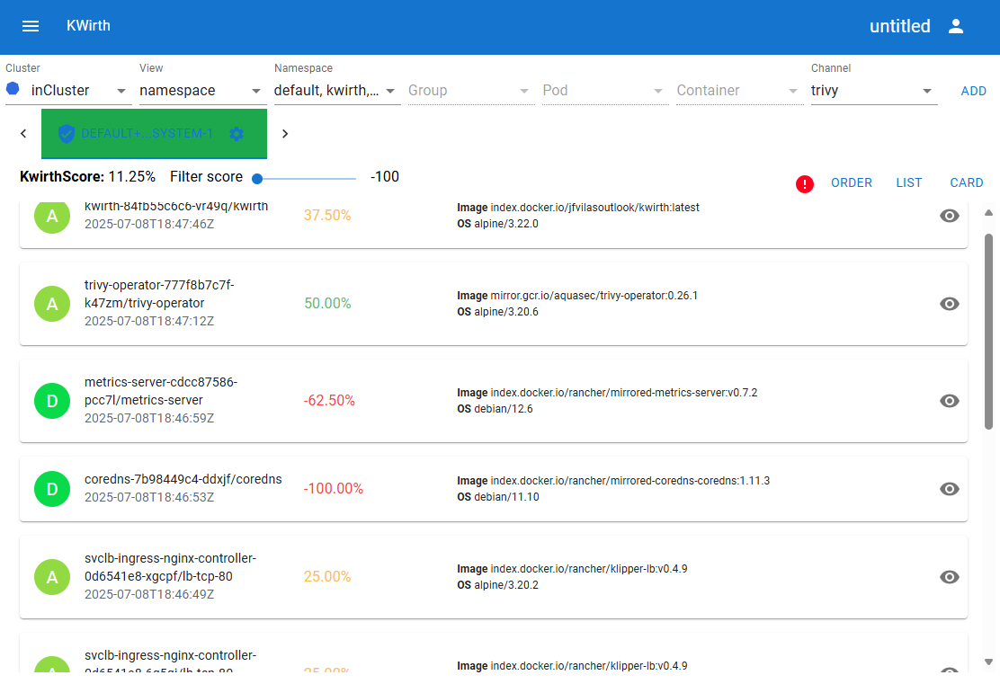
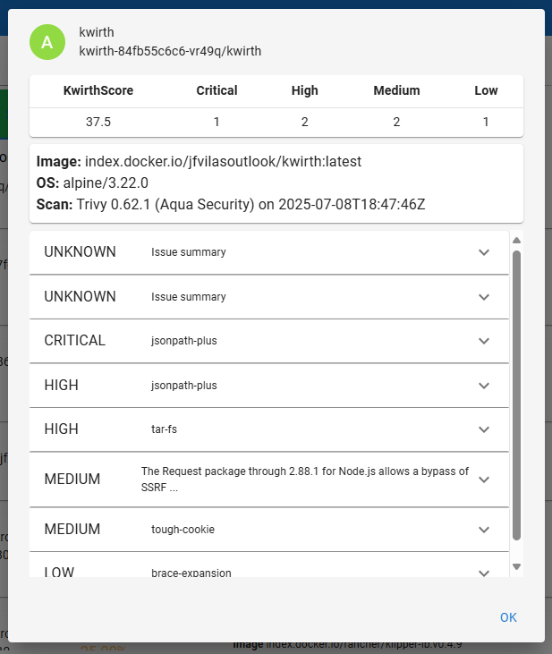

# Trivy channel
We are very proud of one of the last channel we have added to Kwirth: the Trivy Channel. This channel is based on [Trivy OSS](https://trivy.io). Trivy is an excellent piece of software for observing your cybersecurity threads and be aware of your cybersecurity posture.

Kwrith relies on Trivy to send real-time information about the vulnerabiities of your Kubernetes objects. 

## What for
With Trivy Channel you can:

  - Have an score of the security compliance of your Kubernetes objects. As it always happens with Kwirth, you can calculate the Kwirth Security Score on a customized set of objects. Typically, you would use Trivy Channel to calculate a security exposure about all the ocmponents that comprise an application, no matter the namespace they are running on, no matter if they are pods, replica sets, or just individual containers.
  - For each analyzed object, and based on the information provided by Trivy, you can review what vulnerabilities are present in your images (knowing the specific CVE identifier), which versions are impacted by a CVE, which version contains the ammendment, etc. (this information is, of course, provided by Trivy).
  - You can define a dynamic way of calculating Kwirth Security Score by configuring the number of accepted vulnerabilities of each kind (critical, high, medium, low). Ideally, you would set up a fixed configuraiton for all of your items.

## Features
These are key features of Trivy channel:

  - Calculate Kwirth Secure Score, an overall value that asses you cybersecurity posture.
  - Review vulnerability reports for each object in scope individually.
  - Review each CVE for each impacted object individually.
  - Re-evaluate a vulnerability report for an specific object.

## Use
When you start a Trivy Channel you must provide a few things for the vulnerabiity engine to run and show you some results:

  - **Maximum number of accepted issues** of each category of vulnerability, or even just ignore a specific severity (that means accepting as "good" any number of vulnerabilities of a specific kind).

Here are some screenshots of some operations performed with a Trivy Channel. First one shows a general view of a Trivy Channel:

You can switch the view (a card view with details on each object) to a list view, a more simplistic approach to use when you just need an overview of the global situation.

No matter the kind of view you have selected (card or list), you can decide how to order the objects. Two main options are available: score order, scan date order.

I you want to review the details of a vulnerability report, you can do it (from card or list item) and you will get a list of vulnerabilities including its category (critical, high...) and some details.

IF you want to get detailed info on a specific CVE, just click on it to see the details.

If there exist some problem with a Trivy vulnerability report, you'll be noticed via a red error icon on the screen, and clicking on it you can see some specifics on the error.

