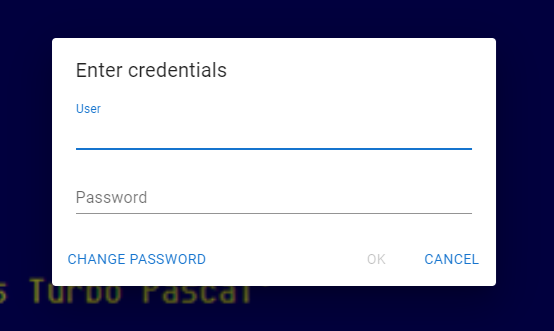
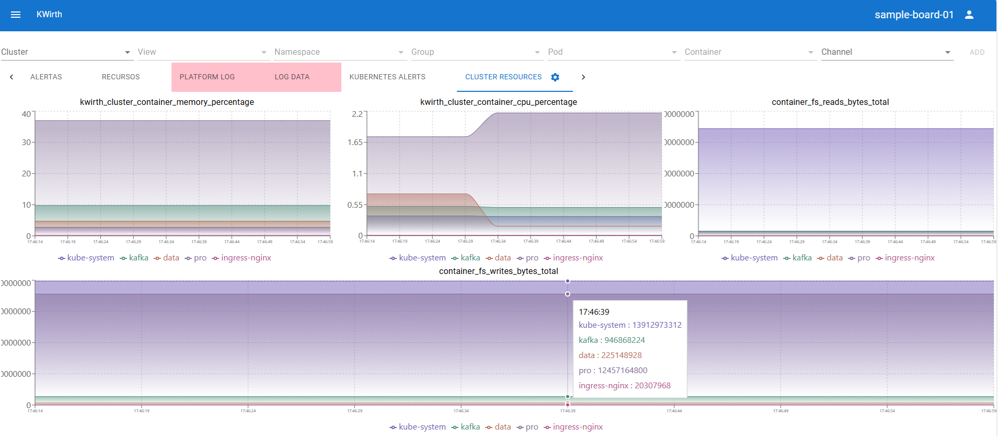

# Common Tasks
Explain how to perform common tasks.

### Your first log
The first time you access your fresh copy of Kwirth you must login with admin credentials, **admin/password** (yes the password is password).

 &nbsp;&nbsp;&nbsp;&nbsp;

So, if everything is ok, you should see the main Kwirth page:

 

What you can see in the main Kwirth is:

  - The toolbar, with your login info (the user on the right), the name of the current view (just before the user), we will see later what is a view. On the very left you'll find the access to the main menu, the burger icon.

    

  - The resource selector. This is one of the most important things in Kwirth.
  
    

    The resource selector is the tool you use to access logs on your source Kubernetes cluster. It has **6 selectors** and the 'add' button (to add the surce object to the view):
    - 'Cluster'. You can see here the list of Kubernetes clusters you have access to. You use this selector to decide what log to add to your view.
    - 'Scope'. Once you select the cluster you must decide the scope of the log you want to add. You can add logs that target the whole cluster (yes, you can consolidate all the logs of your cluster in one only log), a whole namespace (all the pods in a namespace) and one only pod (a pod log can include replica sets, daemon sets and stateful sets).
    - 'Namespace'. If your scope is not cluster, you must select a namespace for deciding your source for logs.
    - 'Set'. If your scope is set, you can select here what set inside the namespace you want to work with. In the selector you will see *replica sets*, *stateful sets* and *daemons sets*.
    - 'Pod'. If the scope is 'pod', you must decide here what pod you want to use as source for your log info.
    - 'Conatiner'. If the scope is 'container', you must decide here what container inside the pod you want to use as source.
  - The main menu gives you access to several configuration and operation options of your Kwirth installation.

    

    These are the actions in the menu:
    - In the first block you can manage your views by creating (new), loading (load) saving (save and 'save as') and deleting views.
    - Next you have options for exporting your views (a set of logs) to a file or import them from a file.
    - Next option  si 'Settings'. In setting panel you can configure defualt behaviours of logs, like maximum number of mesages in a log, adding timestamp to log lines, etc.
    - 'Manage cluster security' gives you the chance to manage another cluster you want to **access from this Kwirth**.
    - 'API security' allows viewing and managing API keys you can create to share with other parties.
    - 'User security' is for managing users that will have access to Kwirth.
    - Update Kwirth (an *admin option* only permforms a Kwirth restart), so if you deployed Kwirth with 'latest' tag in the OCI image, Kwirth will restart with the **newest version**.

### The *views*
A view is a set of log objects, where a log object can have different forms depending on the log configuration:

  - A log object can simply show log inf (log lines, that is stdout of a source object)
  - A log object can be configured to just show selected events, for instance, events linked to alarms.
  - A log object can be configured to show metrics info (future work).
  - A log object can be configured to show alarms linked to metrics thresholds.

A typical view have this form:

Where the content of the view is as follows:

  - Log objects. When you add a source object from the resource selector (by clicking the 'add' button), a new tab would be added to the view, with a default name automatically created depending on the scope and the source object. Tabs can be renamed once created, but their names must be unique.
  - Filter. You can filter what info is shown on the log object (a tab in the view). Filters are the basis for the alarms.

### Alarming
You can use Kwirth just as an alarming tool (or in addtion to your logging needs). Alarming in Kwirth consists of:

  - Define **expressions** that are used to detect anomalies or exceptional situations you want to manage in a special way.
  - Define alarm **severity** and **behaviour**, that is, how important a situation is and how to handle it.

To create an alarm...:

  - Type in a filter in an started log object.
  - Access the log menu (thru the settnigs icon in the tab header) and selet 'Create alarm from filter.
  - Configure alarm settings:
    - Expression
    - Severity
    - Behaviour
    - Sound
  - When yo click 'Save' the alarm is stored in your View and starts running.

You can manage existent alarms for a log object by accessing the log object menu.

