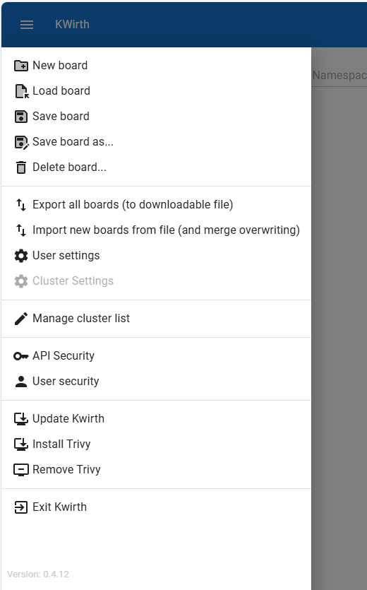

# Common Tasks

## Your first access
The first time you access your fresh copy of Kwirth you must login with admin credentials, **admin/password** (yes the password is password).

 &nbsp;&nbsp;&nbsp;&nbsp;

So, if everything is ok (and you have changed your password, you cannot continue if not), you should see the main Kwirth page:

 

What you can see in the main Kwirth is:

  1. The toolbar, with your login info (the user on the right), the name of the current board (just on the left of the user), we will see later what is a board. On the very left you'll find the access to the main menu, the burger icon.

    

  2. The resource selector. This is one of the most important things in Kwirth.
  
    

    The resource selector is the tool you use to select what kubernetes objects you want to work with. It has **7 selectors** and the 'add' button (to add the objects to the board):
    - **Cluster**. You can see here the list of Kubernetes clusters you have access to. You use this selector to decide what log to add to your board.
    - **View**. Once you select the cluster you must decide the size of the 'view' you want to add. You can add information that targets a whole cluster (yes, you can consolidate all the information you want of your cluster in one only point), a whole namespace (all the pods in a namespace), one only pod (a pod log can include replica sets, daemon sets and stateful sets), or a set of containers (*To have a cluster scope, you should select all namespaces*).
    - **Namespace**. Select here the list of namespaces you want to work with.
    - **Group**. If your view is 'group' or lower, you can select here what group inside the namespaces you selected you want to work with. In the selector you will see *replica sets*, *stateful sets* and *daemons sets*.
    - **Pod**. If the view is 'pod' or lower, you must select what pod/pods you want to use as source object (from a list made of all the namespaces and groups you selected).
    - **Container**. If the view is 'container', you must decide here what container/containers you want to use as source for the data stream. Avaliable containers are thos that live in the pods you selected.
    - **Channel**. Prior to add a resource to the board, you need to specify what kind of information you want to work with. So you must select 'log', 'metrics', 'alert' or whatever channel your Kwirth core server have installed. Read information on (channels here)[chanels].
  3. The main menu gives you access to several configuration and operation options of your Kwirth installation.

    

    These are the actions in the menu:
    - In the first block you can manage your boards by creating (new), loading (load) saving (save and 'save as') and deleting boards.
    - Next you have options for exporting your boards to a file or import them from a file.
    - Next option  is 'User settings'. In user setting panel you can configure default behaviours for your channels, like maximum number of messages in a log, adding timestamp to log lines, setting the interval for refreshing metrics...
    - Next option is 'Cluster settings', where you can set some cluster-wide settings of Kwirth, like, for example, the interval Kwirth use to extract metrics from node's cAdvisor.
    - 'Manage cluster security' gives you the chance to (manage other clusters)[clustermanagement] you want to **access from this Kwirth**.
    - 'API security' allows viewing and (managing API keys)[apimanagement] you can create to share with other parties.
    - 'User security' is for managing users that will have access to this instance of Kwirth.
    - Update Kwirth' (an *admin option* only permforms a Kwirth restart), so if you deployed Kwirth with 'latest' tag in the OCI image, Kwirth will restart with the **newest version**.`
    - **Exit Kwirth**, just logging you off.
    - At the very end of the menu you will find the version of the Kwirth you are working with.

## The *boards*
A board is a set of channel views, where a channel view can have different forms depending on its configuration:

  - A board is a set of tabs.
  - Each tab can have a different channel type (log, metrics...)

A typical board have this form:

Where the content of the board is as follows:

  - Tabs with log objects.
  - Tabs with metrics (chart views).
  - Tabs with alert systems.
  - Tabs names can be colored indicating: the tab has new content pending (pink), the tab is runnig, or the tab is paused (gray).
