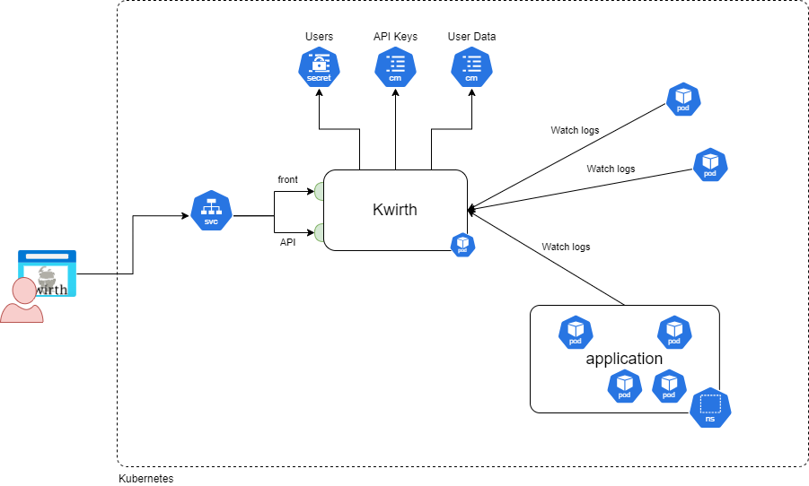

# How it works
Basically, Kwirth receives object information from objects that live in one or more Kubernetes clusters in real-time, and with the data received you can do several thinks depending on your role.

  - Kwirth can be used on Operations areas for detecting exceptional situations.
  - A Security team (a SOC) can also configure alerts on messages received from the source logs.
  - Devops teams can view real-time metrics of kubernetes clusters under control.
  - It can also be used by development teams for reviewing logs of the services deployed to the cluster.

# Architecture
As we said before, Kwirth needs just one pod **with no persistence** for running (yes, you don't have to deal with PV's PVC's, NFS, CIFS, local disks and so on). Kwirth stores its identity objects (users) in Kubernetes secrets, that is: **in etcd**. In addition, all user configuration is also stored in config maps, so, **etcd** again.

What follows is a self-explaining architecture of a typical deployment of Kwirth.

