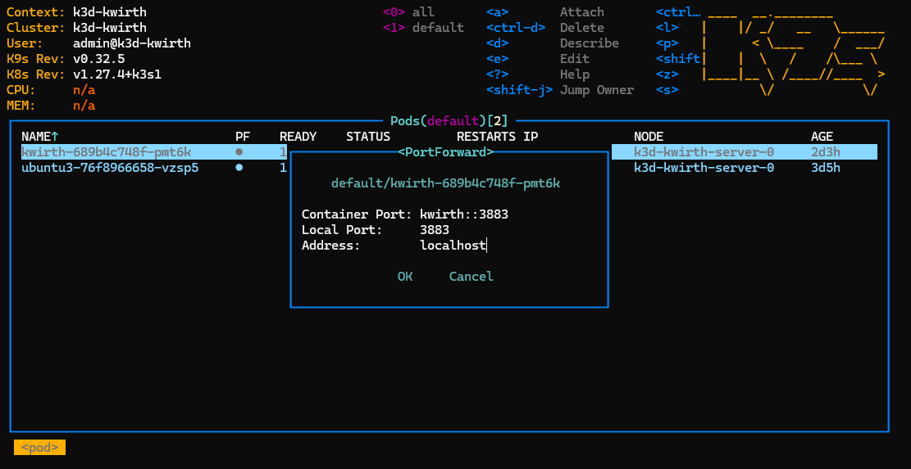

# Kwirth
Kwirth is the final implementation of the idea of having a simple way to manage logging inside a Kubernetes cluster. Maybe you feel comfortable with your DataDog or your Grafana and the Loki and the Promtrail. But maybe these (and other tools) are too complex for you.

You can access the source code [here](https://github.com/jfvilasPersonal/kwirth)

**Kwirth is the answer to your need**. Just *one pod to access all the logs you need* from your main cluster or even **consolidate logging from different clusters**.

## Installation
Yes, **one only command**, just a simple 'kubectl' is enough for deploying Kwirth to your cluster.

```bash
kubectl apply -f https://raw.githubusercontent.com/jfvilasPersonal/kwirth/master/test/kwirth.yaml
```

If everything is ok, in no more than 8 to 10 seconds Kwirth should be up and running. So next step is accessing the front application of your fresh new logging and alerting system.

Several options here...

1. You can just access via **port forwarding** on the command line:
```bash
kubectl port-forward svc/kwirth-svc 3883
```

2. Using the port forwarding options of your favourite Kubernetes management tool, like Lens, Headlamp, K9S, etc... (etc was not a Kubernetes tool when I wrote this article ;) ).

    - With Headlamp...
      
      

    - With Lens...

      

    - With K9S. Just select the Kwirth pod and press **Caps+F**, then just accept (or change) the port sugegstions from K9s and navigate...

      


3. **Using an Ingress**. It is the best option if you plan to access your Kwirth from Internet and if you also plan to share Kwirth with the development team in your corporate private network. For publishing Kwirth to be accesible from outside the cluster, you must create an Ingress. It is a pending job to enable Kwirth to listen in a non-root path, so you could share the Ingress object with other applications, but for the momment Kwirth only works at root path. Next sample is for publishing external access like this (of course, you can rewrite the target URL's in your reverse-proxy or in the Ingress, stripping part of the local path).

```yaml
Pending
```
