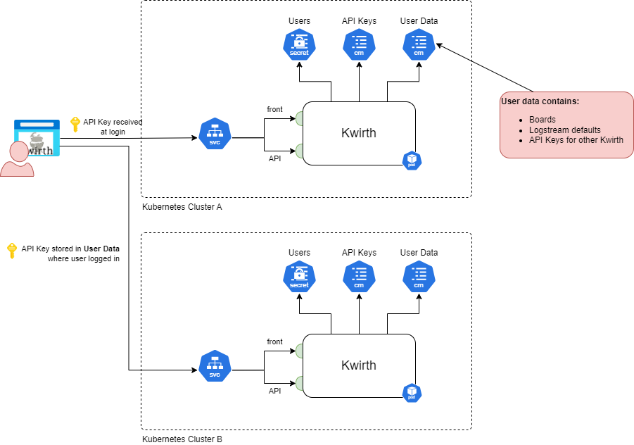

# Kwirth security
There exist three levels of security that must be taken into account:

  1. Administrators security.
  2. User security.
  3. API security.

### Administrator security
When you first deploy Kwirth there will exist an admin account. The credentials for the admin account are strong credentials like these:

  - User: admin
  - Password: password

The first time you access Kwrith you must use the admin credentials, and Kwirth will force you to change the password. You cannot continue the login process without changing the password.

The admin is the only user who can perform security related activities, like creating other users or managing API keys for enabling access to Kwirth from otrher Kwirth fontal apps.

### User security
You can create, modify and delete users using "User security" menu option from the main Kwirth menu. If you are not an admin user you will not see this option. In the initial versions of Kwirth, only one admin user is possible, who is the responsible of creating all non-admin users you need. There is no more RBAC implemented than *being-an-admin* or *just-being-human*.

In the near future we plan to add roles and specific object roles, so users could have different permission sets on different log objects or boards. For example, a user could edit a board in a development cluster but have only viewing permissions on a production cluster.

### API security
You can create, modify and delete API keys using "API security" menu option from the main Kwirth menu. If you are not an admin user you will not see this option.

API Security is the mechanism you use to give API Keys to another external application like Kubelog in order for them to access Kwirth resources like log streams.

On the other side, API security is the way you can use to give access to your Kwirth to users that work with another Kwirth. The diagram below explains how this works (refer to API Management documentation to undertand basic concepts).

As you can see...:

  1. The user logs to Kwirth at Kubernetes cluster "A".
  2. Another adminstartor at cluster "B" gave him an API Key that he adds to his "API Security".
  3. When the user wants to see a log stream from cluster "B" he doesn't need to logout cluster "A" nor login cluster "B". When the user selects cluster "B" in his "Resource Selector", Kwirth will use the appropriate API Key.

It's easy to work with. Enjoy!
