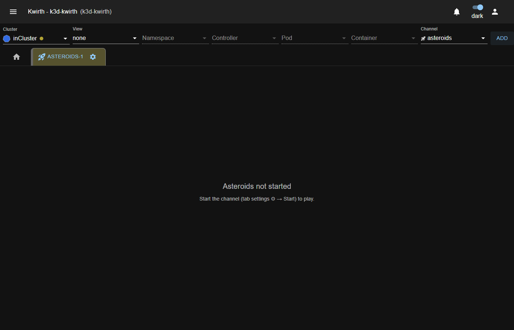
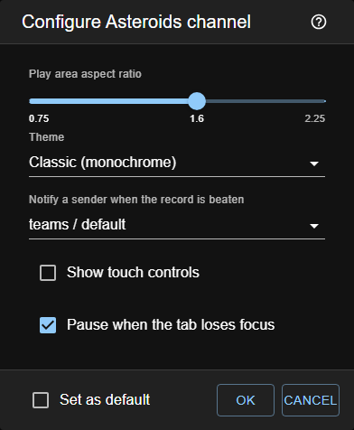

# Adding and configuring the channel

## 1. Add the tab

In Kwirth's top bar:

1. **Cluster** → the cluster where you want to play. It matters: [the high-score table is per
   cluster](05-high-scores.md).
2. **View** → `none` is the natural one, since it is a [standalone channel](01-introduction.md), but
   any will do: the channel receives no resource in any case.
3. **Channel** → `asteroids`.
4. **ADD**.

With the `none` view, the **Namespace**, **Controller**, **Pod** and **Container** selectors are
greyed out. That is expected: the channel does not observe any resource. If you choose another view
and fill in those selectors, nothing happens either: the channel receives them empty anyway.

## 2. The channel added, still stopped

Kwirth distinguishes **adding** a channel from **starting** it. Freshly added, the tab exists but the
game is not running yet, and it tells you so.

You will not see the score bar: with the game not started it could only show you zeros, so it
appears when the channel starts. Nor will you see the game's black canvas, for the same reason — an
empty black rectangle would look like a broken tab.

## 3. Start and configure

Click the tab's **gear** icon → **Start**. Before starting, the configuration dialog opens:

| Option | What it does |
|---|---|
| **Play area aspect ratio** | The aspect ratio of the play area, between 0.75 and 2.25 (1.6 by default). **It does not change the difficulty**: the world's area is constant and the ratio only splits it between width and height ([why](02-how-it-works.md)). |
| **Theme** | `Classic (monochrome)` reproduces the look of the original arcade, all white strokes on black. `Color` uses a vivid palette. |
| **Show touch controls** | Adds on-screen buttons —turn, thrust, fire and START— to play without a keyboard. |
| **Pause when the tab loses focus** | Pauses the game when you leave the tab. It is best left enabled: otherwise the ship keeps flying while you look at something else, and you usually come back with one life less. |

Confirm with **OK** and the channel starts.

> **Set as default** saves those options as the ones for the next Asteroids tabs you open. Without
> ticking it, they apply only to this one.

The **?** icon in the top-right corner of the dialog opens this very page.

## Changing the configuration later

Open the dialog again from the tab's gear icon. The aspect ratio is applied instantly; so is the
rest.
