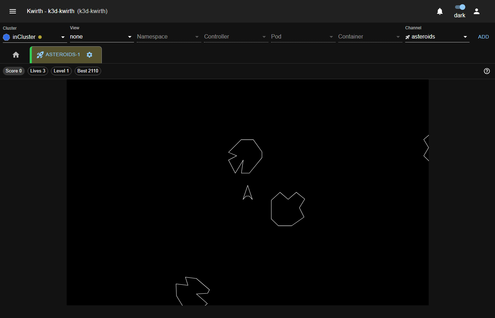

# Playing

## Starting

**Click the play area** to give it the keyboard focus and press **Enter**.

The click is not optional: the game [only listens while it has the focus](02-how-it-works.md), so as
not to steal keys from the rest of Kwirth. If you press Enter and nothing happens, this is almost
always why.

## Controls

| Key | Action |
|---|---|
| ← / → (or A / D) | Turn |
| ↑ (or W) | Thrust |
| Space | Fire |
| Shift (or H) | Hyperspace |
| Enter | Start or restart the game |

The ship has **inertia**: thrust accelerates, but there is no brake. To stop you have to turn the
other way and thrust again. That is how the original arcade behaves, and it is half the difficulty
of the game.

**Hyperspace** teleports you to a random point in the world. It gets you out of trouble when you
are surrounded, but it is a gamble: the destination is random and can leave you right on top of a
rock.

If you enabled **Show touch controls** in the configuration, you have the same controls as on-screen
buttons, below the play area.

## How to play

You shoot the asteroids and they break into smaller pieces; the smaller pieces break in turn, until
they disappear. The level ends when you clear the screen, and the next one starts with more rocks.

Every now and then a **UFO** appears and shoots. It is worth quite a few points.

You start with **3 lives**. Every so many points you earn an extra life, up to a maximum of 3: in
other words, extra lives serve to recover what you lost, not to build up a cushion.

## The score bar

It appears when the channel starts, above the play area:

| Indicator | What it is |
|---|---|
| **Score** | The score of the current game. |
| **Lives** | The lives you have left. |
| **Level** | The current level. |
| **Best** | The best score in the **cluster's table**, not yours. It is the mark to beat. |

If the game is paused, a **paused** indicator also appears.

## Fullscreen

When the channel is shown in Kwirth's fullscreen mode, Kwirth's tab bar disappears. In its place,
Asteroids shows its own bar at the top with the plugin icon, the channel name and the cluster it is
connected to, so you still know where you are playing.

## Pausing, stopping and coming back

- **Pause** and **Continue**, in the gear menu, freeze and resume the game.
- If *Pause when the tab loses focus* is enabled, leaving the tab pauses it automatically and coming
  back resumes it.
- **Stop** discards the game and returns the tab to the initial message. The high-score table is
  not touched: it belongs to the cluster, not to your game.
- Switching to another Kwirth tab and coming back **does not lose the game**:
  [it continues exactly where it was](02-how-it-works.md).
