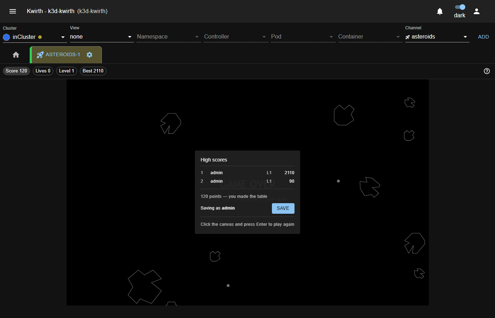

# The high-score table

When you lose your last life, the high-score panel appears with the ten best scores:

If your game makes it into the table, the panel offers to save it **with your Kwirth user**: no
alias is typed, it shows *Saving as …* with your identity, and pressing **SAVE** is enough. To play
again, click the play area and press **Enter**.

## The table belongs to the whole cluster

This is the important part, and it is worth not getting it wrong: **the table is not yours, nor your
browser's**. It lives in the cluster, in a Kubernetes ConfigMap. Therefore:

- **Every user** of that Kwirth sees it, not just you.
- It survives closing the browser, clearing cookies or changing computers. Log in from another
  machine and it is still there.
- When someone scores, **every** open Asteroids tab sees the new table instantly, without reloading.
  If you have the channel open, you can watch people overtake you in real time.
- **Each cluster has its own.** Playing on the development cluster does not score on the production
  one.

The **Best** indicator in the score bar is the number one of that shared table, not your best game.

## Rules

- Only scores **greater than zero** get in. Dying without firing does not ask for a name.
- While there are fewer than ten entries, any positive score gets in.
- With the table full, you have to **beat** the last one. A tie does not get in.
- The name is trimmed to 24 characters and control characters are removed.
- The date is set by the server, not by your browser.

## About the name

The name that is saved is **your Kwirth user**, the same one you logged in with. It is not an alias
you type, so the table really says who played each game, and two people cannot sign with the same
name.

It is trimmed to 24 characters, which is more than enough for a normal user name.

## If your high score does not appear

Most likely you did not beat the last entry. If you think you did and it still does not appear, or
Kwirth showed *"The score could not be saved"*, check [Troubleshooting](../admin/04-troubleshooting.md):
there is an uncommon case in which the score does not reach the server.
